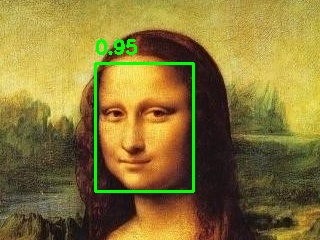
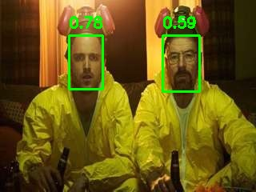
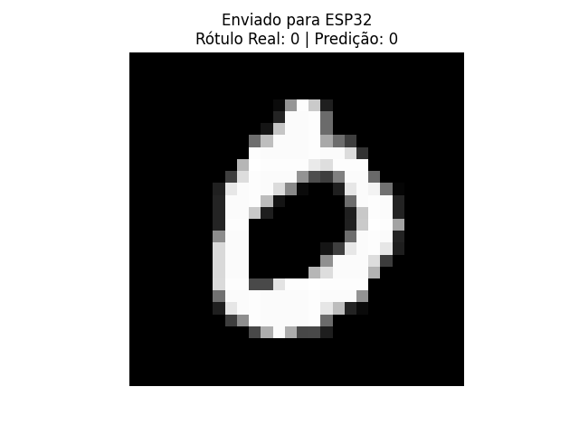

# ESP32 AI at the Edge

Conjunto de exemplos práticos para rodar **IA em microcontroladores ESP32**, com **TensorFlow Lite for Microcontrollers (TFLM)** e **ESP-DL**. Os projetos cobrem desde o clássico *Hello World* ( previsão do seno de um angulo) até classificadores (MNIST e CIFAR-10) e detecção de faces no dispositivo.


## Estrutura do repositório

```
ESP32_AI_at_the_edge/
├─ ESP-DL-face-detect/           # Detecção de face usando ESP-DL
├─ TF_Lite-CIFAR10/              # Classificador CIFAR-10 com TFLite Micro
├─ TF_Lite-Cifar10_MobileNetv2/  # CIFAR-10 com backbone MobileNetV2 (TFLM)
├─ TF_Lite-MNIST_Digits/         # Classificador de dígitos MNIST com TFLM
├─ TF_Lite-Sine_Model/           # Hello World: modelo de seno (TFLM)
└─ .gitignore
```

> Os nomes acima são exatamente os diretórios do repo. ([GitHub](https://github.com/vini-muchulski/ESP32_AI_at_the_edge))

## Pré-requisitos

* **TensorFlow Lite for Microcontrollers** (exemplos como o *Hello World/sine*). ([Google AI for Developers](https://ai.google.dev/edge/litert/microcontrollers/get_started))
* Os projetos em Tensorflow Lite já incluem a biblioteca TFlite na pasta libs.
* Todos os codigos possuem a opção de  utilizar o wifi do ESP32 para  envio de um dado/imagem via API para o modelo no esp32 realizar a inferencia e retornar o resultado. Verifique as variaveis SSID e Password dentro dos codigos a serem carregados no ESP32
* **ESP-IDF** - Para o projeto ESP-DL-face-detect , você usará `idf.py` para configurar, compilar, gravar e monitorar. ([docs.espressif.com](https://docs.espressif.com/projects/esp-idf/en/stable/esp32/api-guides/tools/idf-py.html))

##

## Projetos incluídos

### TF\_Lite-Sine\_Model (Hello World)

Exemplo mínimo do TFLM: um modelo prevê valores de seno, útil para validar toolchain e fluxo *train → converter → embarcar*.&#x20;

### TF\_Lite-MNIST\_Digits

Classificador de dígitos (0–9) rodando no ESP32 com TFLite. Ideal para testar pipeline de classificação, quantização e I/O simples. Utilize o codigo em python 

### TF_Lite-CIFAR10
Classificação de imagens em 10 classes com TFLM. Útil para estudar pré-processamento leve e classificação em microcontroladores com recursos limitados.

### TF_Lite-Cifar10_MobileNetv2
Variante do projeto CIFAR-10 utilizando o backbone MobileNetV2, oferecendo melhor acurácia com custo computacional moderado, otimizado para restrições de memória/compute dos ESPs.
### ESP-DL-face-detect

Detecção de face usando **ESP-DL** — framework leve da Espressif para inferência em ESP32. Para saber mais: ([GitHub](https://github.com/espressif/esp-dl), [docs.espressif.com](https://docs.espressif.com/projects/esp-dl/en/latest/getting_started/readme.html))

##

## Hardware

* utilizei o  ESP32 para o projeto do Seno
* utilizei o   ESP32-S3 para o projeto de CNNs embarcadas devido a presença de PSRAM nesse tipo de microcontrolador

##

## 📄 Licença

Apache-2.0

---
