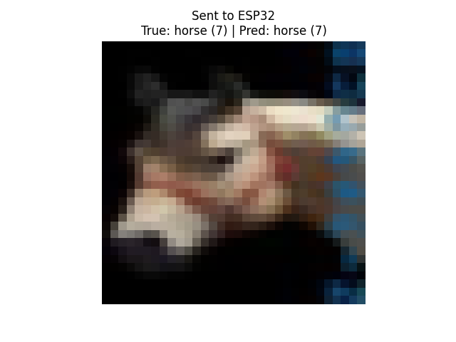
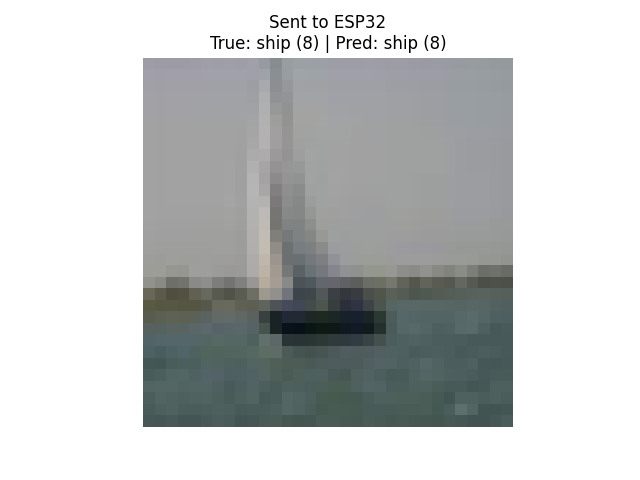
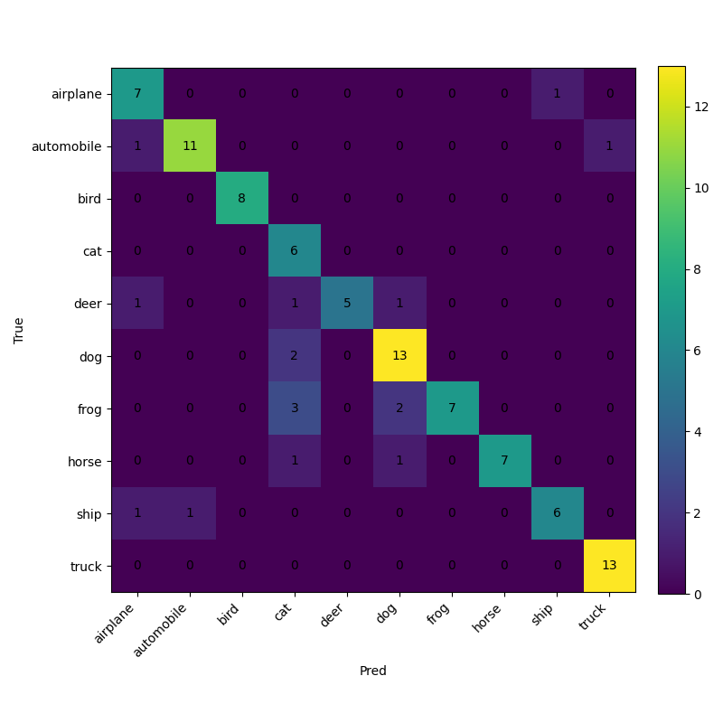

# ESP32-S3 CIFAR-10 MobileNetV2 (TensorFlow Lite Micro)

This project runs an INT8-quantized MobileNetV2 model on an ESP32-S3 and exposes inference over Wi-Fi (`POST /predict`).

## What this project includes

- ESP32 firmware with TensorFlow Lite Micro: `src/main.cpp`
- Training/export script (MobileNetV2 -> `.tflite`): `src/cifar10-mobilenetv2-tflite-int8.py`
- Header generation helper commands: `src/comands.txt`
- Single inference client: `src/test_inference.py`
- Batch evaluation client: `src/teste_evalute.py`

## Requirements

- ESP32-S3 board with PSRAM (configured in `platformio.ini`)
- VS Code + **PlatformIO IDE** extension
- Python 3.10+ (for training/testing scripts)

## Quick Start (VS Code + PlatformIO)

1. Open this project folder in VS Code.
2. Install the **PlatformIO IDE** extension.
3. Connect your ESP32-S3 board via USB.
4. In `platformio.ini`, check:
   - `upload_port` (example: `/dev/ttyUSB0`)
   - board/environment settings (`[env:esp32s3]`)
5. Generate/update the model header (inside `src/`):

```bash
xxd -i model_simple_int8.tflite > model_simple_int8.h
sed -i '1i #include <pgmspace.h>\n' model_simple_int8.h
sed -i 's/^unsigned char /const unsigned char /' model_simple_int8.h
sed -i 's/^unsigned int /const unsigned int /' model_simple_int8.h
sed -i 's/\[\] =/[] PROGMEM =/' model_simple_int8.h
```

6. Build and upload from PlatformIO:
   - `PlatformIO: Build`
   - `PlatformIO: Upload`
7. Open serial monitor (`PlatformIO: Monitor`) at `115200` baud.

## Wi-Fi and API

Firmware starts an HTTP server on port `80`.

- `POST /predict`
  - JSON body: `{"q_pixels": [150528 quantized values]}`
  - Returns prediction, confidence, and timing fields (`receive_ms`, `parse_ms`, `inference_ms`, `total_ms`)
- `GET /status`
  - Returns `model_initialized` and system status

Wi-Fi credentials are controlled by `WIFI_SSID` / `WIFI_PASSWORD` macros in `src/main.cpp` (or by compile-time defines if you inject them).

## Python Usage

Run single inference:

```bash
cd src
python test_inference.py
```

Run batch evaluation:

```bash
cd src
python teste_evalute.py
```

## Results

Example outputs from `src/results`:







