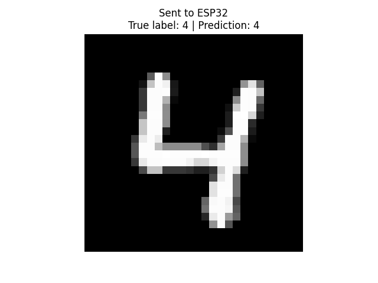

# ESP32-S3 MNIST Digits (TensorFlow Lite Micro)

This project runs an INT8-quantized MNIST digits model on an ESP32-S3 and exposes inference over Wi-Fi (`POST /predict`).

## Results

Example outputs:



CSV metrics: `src/eval_results.csv`.

## What this project includes

- ESP32 firmware with TensorFlow Lite Micro: `src/main.cpp`
- Training/export script: `src/mnist-small-model-tflite-int8.py`
- Embedded model and header conversion commands: `src/model_simple_int8.tflite`, `src/mnist_model_data.h`, `src/comands.txt`
- Input metadata helper: `src/get_input_info.py` and `src/input_info.json`
- Single inference client: `src/test_inference.py`
- Batch evaluation client: `src/teste_evalute.py`
- Kaggle notebook (training/export reference): [mnist-small-model-tflite-int8](https://www.kaggle.com/code/vinimuchulski/mnist-small-model-tflite-int8)

## Requirements

- ESP32-S3 board with PSRAM (configured in `platformio.ini`)
- VS Code + **PlatformIO IDE** extension
- Python 3.10+ (for training/testing scripts)

## Quick Start (VS Code + PlatformIO)

1. Open this folder in VS Code.
2. Install the **PlatformIO IDE** extension.
3. Connect your ESP32-S3 via USB.
4. Check `platformio.ini`:
   - `upload_port` (for example `/dev/ttyUSB0`)
   - environment `[env:esp32s3]`
5. If you need to regenerate the model header, follow `src/comands.txt`.
6. Build and upload:
   - `PlatformIO: Build`
   - `PlatformIO: Upload`
7. Open serial monitor (`PlatformIO: Monitor`) at `115200` baud.

## Wi-Fi and API

Firmware starts an HTTP server on port `80`.

- `POST /predict`
  - JSON body: `{"q_pixels": [784 quantized values]}`
  - Returns prediction, confidence, and timing fields
- `GET /status`
  - Returns model/system initialization status

Wi-Fi credentials are controlled by `WIFI_SSID` / `WIFI_PASSWORD` in `src/main.cpp` (or compile-time defines).

## Python Usage

Run single inference:

```bash
cd src
python test_inference.py
```

Run batch evaluation:

```bash
cd src
python teste_evalute.py
```
